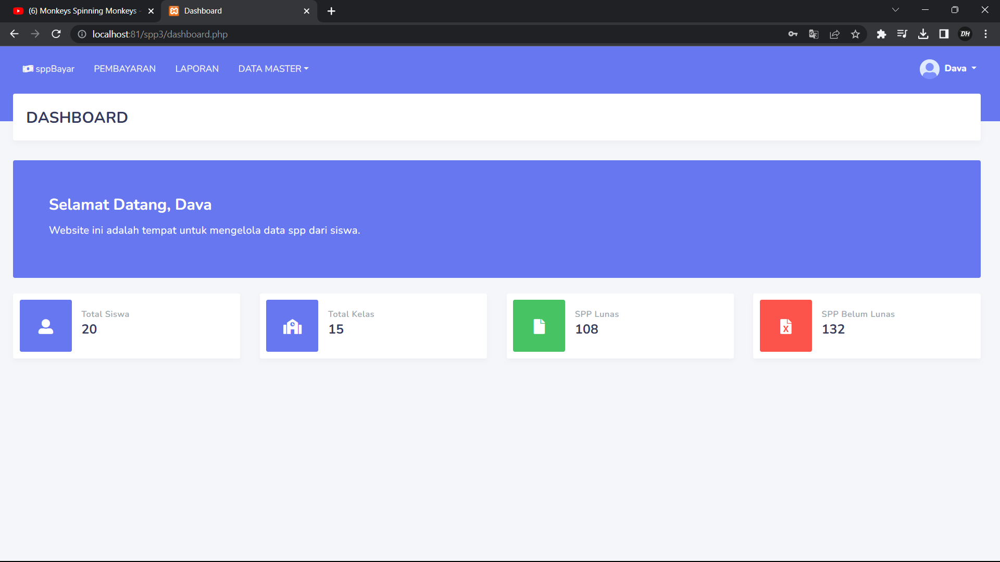
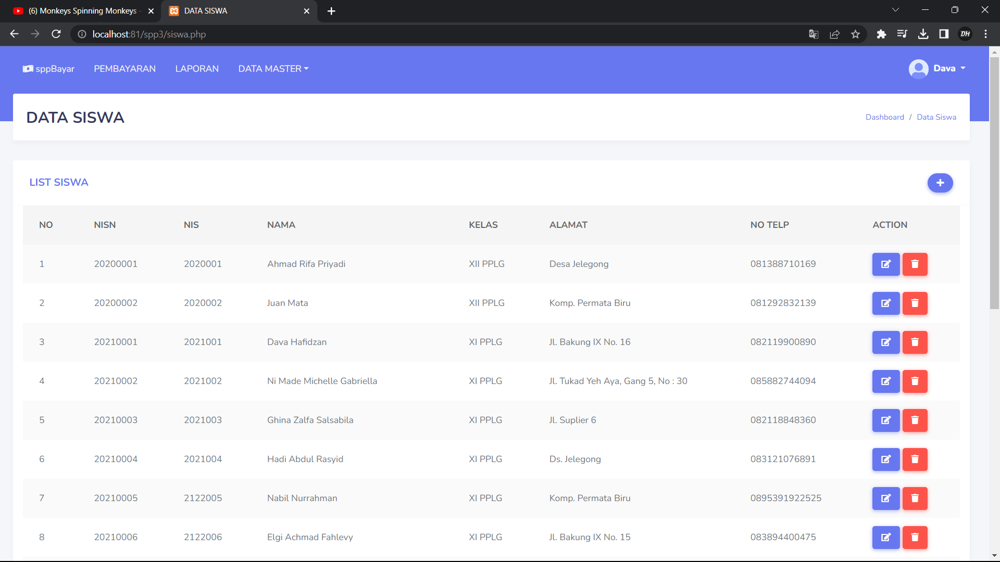
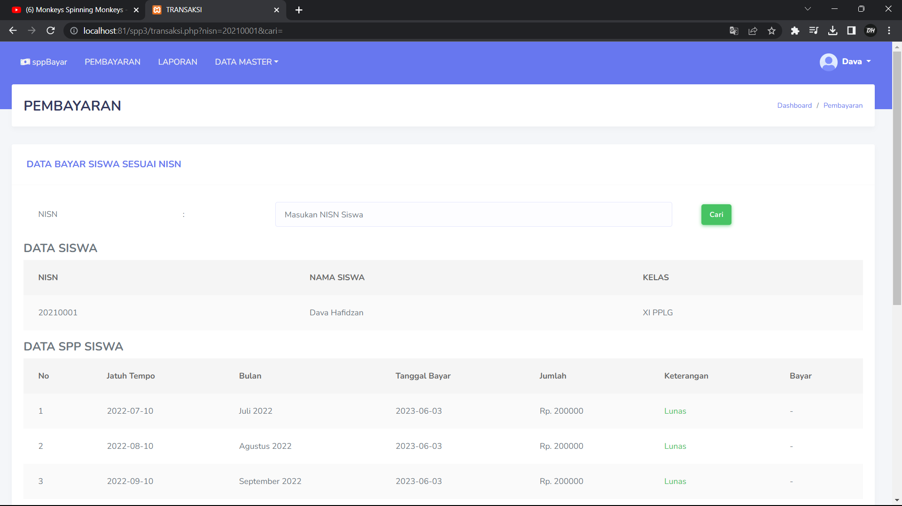

# sppBayar
> Aplikasi Web Pembayaran SPP sederhana.

## Table of Contents
* [General Info](#general-information)
* [Features](#features)
* [Screenshots](#screenshots)
* [Usage](#usage)
* [Project Status](#project-status)

## General Information
- Aplikasi ini bisa memudahkan dalam me-manage iuran sekolah.
- Tujuannya dibuat aplikasi ini untuk tugas sekolah.

## Features
- Multi-user
- Dynamic Dashboard

## Screenshots
- Dashboard

- Kelas

- Pembayaran

## Usage
User :
* Admin
 - username : admin
 - password : admin

* Petugas
 - username : petugas
 - password : petugas

* Siswa
  - username : 2021001
  - password : dava666

## Project Status
Project is: _complete_
